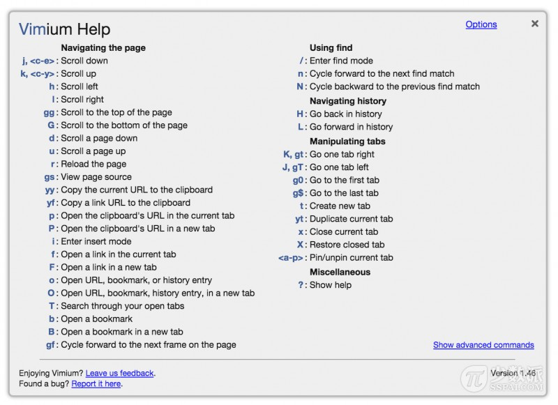

# Vimium 插件方法

通过一系列快捷键，来操作网页

手腱膜炎又颜值严重了。开始想脱离鼠标。

[https://chrome.google.com/webstore/detail/vimium/dbepggeogbaibhgnhhndojpepiihcmeb](https://chrome.google.com/webstore/detail/vimium/dbepggeogbaibhgnhhndojpepiihcmeb)

\[参考文档]\([https://sspai.com/post/27723](https://sspai.com/post/27723)）

h、l、k和j分别实现左、右、上和下

j,:向下滚动页面

k,向上滚动页面

gg:顶部

G:底部

d:向下滚动半个页面

u:向上滚动半个页面

h:向左滚动页面

shift+h  退后

shift+j 新标签向右移动

shift+k  新标签向左移动

x  关闭标签页

r:重新加载页面(刷新页面(f5

o  **从收藏夹、历史记录打开：**&#x20;

yy:[复制](https://xiaoheidiannao.com/articles/Copy.html)当前页面地址到[剪贴板](https://xiaoheidiannao.com/articles/Clipboard.html)

gi:定位到页面中的第一个输入框, 2gi 3gi

f/shift+F  显示当前页面快捷键&#x20;

退出输入状态，按esc. 进入输入按i.  比如，我输入完这句了->按esc->按f定位出右下角的回复即可

