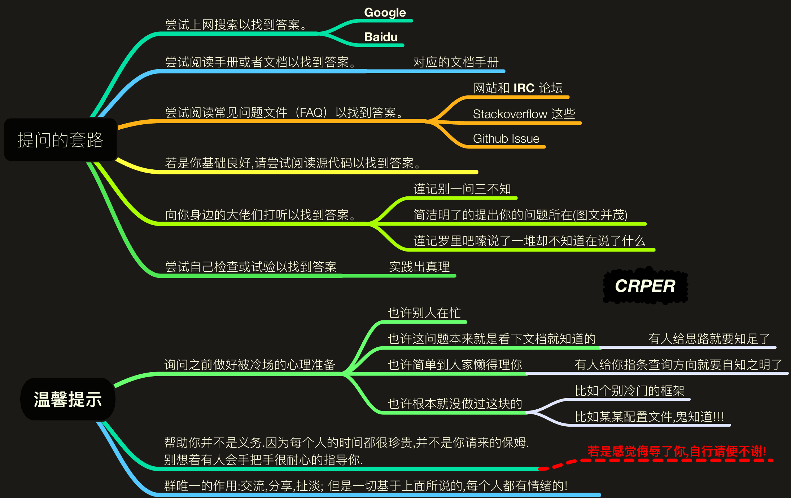

# Vimium 插件方法

可视模式下（有效启动状态

h、l、k和j分别实现左、右、上和下

j,[Ctrl+E](https://xiaoheidiannao.com/articles/Ctrl-E.html):向下滚动页面

k,[Ctrl+Y](https://xiaoheidiannao.com/articles/Ctrl-Y.html):向上滚动页面

gg:顶部

G:底部

d:向下滚动半个页面

u:向上滚动半个页面

h:向左滚动页面

l:向右滚动页面

r:重新加载页面(刷新页面(f5

yy:[复制](https://xiaoheidiannao.com/articles/Copy.html)当前页面地址到[剪贴板](https://xiaoheidiannao.com/articles/Clipboard.html)

gi:定位到页面中的第一个输入框,&#x20;

